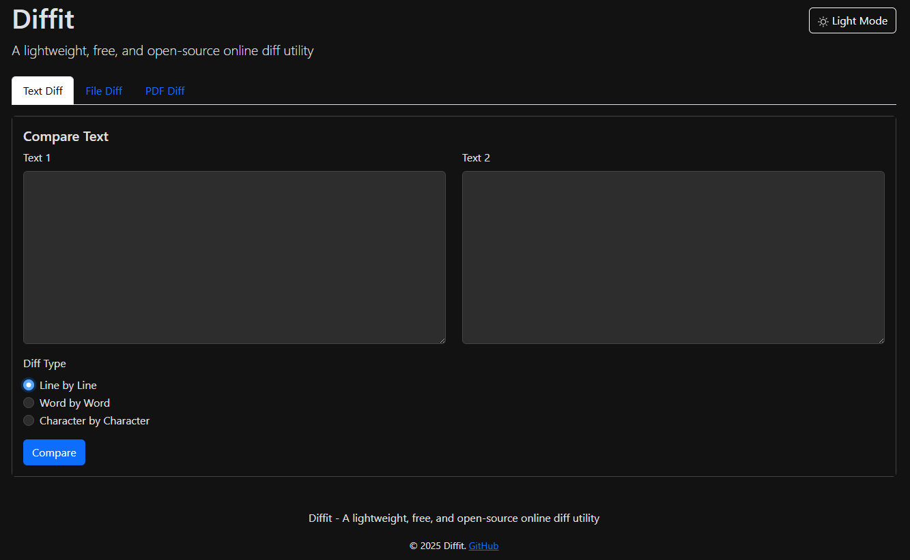

# diffit.tools

## Overview
Diffit is a lightweight, free, and open-source online diff utility that allows users to compare text, files, and PDFs. The application provides an easy-to-use interface to generate visual diffs of user input and file content through a web-based interface.



## Live Demo
[Diffit](https://diffit.tools)

## Core Features
- **Text Comparison:** Compare two blocks of text with side-by-side diff visualization
- **File Comparison:** Upload and compare files such as `.txt`, `.csv`, `.json`, etc.
- **PDF Diff:** Extract and compare text content from PDF documents
- **Multiple Diff Types:** Support for line-by-line, word-by-word, or character-level differences
- **Dark Mode:** Toggle between light and dark themes for better readability
- **Export Options:** Export diff results as PDF (client-side) or Markdown
- **Shareable URLs:** Generate shareable links for diff results

## Tech Stack
- **Backend:** Python with FastAPI
- **Diff Logic:** Python's `difflib` with custom HTML rendering
- **File Handling:** `aiofiles`, `pdfminer.six` for PDF text extraction
- **Frontend:** Jinja2 templates, HTML, JavaScript, and Bootstrap CSS
- **PDF Export:** Client-side using html2pdf.js
- **Markdown Export:** Server-side using html2text
- **Database:** PostgreSQL (Supabase) for storing diff results
- **Deployment:** Vercel serverless platform

## Installation and Setup

### Prerequisites
- Python 3.9+
- PostgreSQL database (or SQLite for local development)

### Local Development
1. Clone the repository:
   ```bash
   git clone https://github.com/amanthanvi/diffit-tools.git
   cd diffit-tools
   ```

2. Create a virtual environment:
   ```bash
   python -m venv venv
   source venv/bin/activate  # On Windows: venv\Scripts\activate
   ```

3. Install dependencies:
   ```bash
   pip install -r requirements.txt
   ```

4. Run the application:
   ```bash
   uvicorn app:app --reload --port 8000
   ```

5. Access the application at `http://localhost:8000`

### Environment Variables
For production deployment, set the following environment variables:
- `DATABASE_URL`: PostgreSQL connection string
- `SESSION_SECRET_KEY`: Secret for session encryption
- `VERCEL`: Set to "1" for production

## Deployment
Diffit is optimized for deployment on Vercel:

1. Create a Vercel account if you don't have one
2. Install the Vercel CLI:
   ```bash
   npm install -g vercel
   ```

3. Deploy:
   ```bash
   vercel
   ```

4. Configure environment variables in the Vercel dashboard

## Project Structure
```
diffit-tools/
├── static/               # Static assets
│   ├── css/              # CSS styles
│   ├── js/               # JavaScript files
│   └── favicon.ico       # Favicon
├── templates/            # Jinja2 templates
│   └── index.html        # Main template
├── app.py                # Main application file
├── diff_logic.py         # Diff generation logic
├── database.py           # Database models and connection
├── crud.py               # Database operations
├── requirements.txt      # Python dependencies
├── vercel.json           # Vercel configuration
├── README.md             # Project documentation
└── LICENSE               # License information
```

## Contributing
Contributions to Diffit are welcome! Please follow these steps:

1. Fork the repository
2. Create a feature branch: `git checkout -b feature-name`
3. Commit your changes: `git commit -m 'Add some feature'`
4. Push to the branch: `git push origin feature-name`
5. Submit a pull request

Please follow the [Code of Conduct](CODE_OF_CONDUCT.md) when contributing.

## License
This project is licensed under the MIT License - see the [LICENSE](LICENSE) file for details.

## Acknowledgments
- [difflib](https://docs.python.org/3/library/difflib.html) for the diff algorithm
- [html2pdf.js](https://github.com/eKoopmans/html2pdf.js) for client-side PDF generation
- [pdfminer.six](https://github.com/pdfminer/pdfminer.six) for PDF text extraction
- [FastAPI](https://fastapi.tiangolo.com/) for the web framework
- [Bootstrap](https://getbootstrap.com/) for the UI components
